# Schemadiff



A CLI tool that inspects and compares the schemas of CSV and Parquet files.

<div style="height: 3px; width: 100%; background: linear-gradient(to right, #00c6ff, #0072ff); box-shadow: 0px 2px 8px rgba(0, 198, 255, 0.5); margin: 30px 0;"></div>


## Installation


Requires Go 1.24+ (a Go 1.21+ toolchain will typically auto-fetch a newer
one if needed, since that's driven by this module's `go.mod`).

**If you just want to run it** (no cloning, no manual build):

```bash
go install github.com/nbaubek/schemadiff@latest
```

This fetches the module, resolves and builds its dependencies (Cobra,
parquet-go, and the AWS SDK for S3 support) using the checksums already
pinned in `go.sum`, and installs the `schemadiff` binary to
`$(go env GOPATH)/bin` (commonly `~/go/bin`). If that directory is on
your `PATH`, you can then run `schemadiff` directly from anywhere -- no
local copy of this repo needed.

**If you're developing on the project itself**, clone it and build
locally instead:

```
git clone https://github.com/nbaubek/schemadiff.git
cd schemadiff
go mod tidy
go build -o schemadiff .
go test ./...
```

<div style="height: 3px; width: 100%; background: linear-gradient(to right, #00c6ff, #0072ff); box-shadow: 0px 2px 8px rgba(0, 198, 255, 0.5); margin: 30px 0;"></div>


## Usage

If installed via `go install` (see above), the binary is just
`schemadiff` on your `PATH`. If you built it locally instead, run it as
`./schemadiff` from the project directory.

Inspect a single file's schema:

```
schemadiff inspect --csv data.csv
schemadiff inspect --parquet data.parquet
```

Compare two files (formats may differ -- CSV vs CSV, Parquet vs Parquet,
or CSV vs Parquet):

```
schemadiff diff old.csv new.csv
schemadiff diff old.csv new.parquet
```

Exit codes follow the `diff(1)` convention:
- `0` — no schema differences (or `inspect` ran fine)
- `1` — `diff` found schema differences (useful as a CI gate)
- `2` — usage or runtime error (bad args, missing file, unrecognized format)

Files may be local paths or `s3://bucket/key` URIs, and can be mixed:

```
schemadiff diff s3://my-bucket/old.csv new.parquet
```

**S3 authentication is entirely delegated to the AWS SDK's standard
credential chain** (env vars, `~/.aws/credentials`, IAM role/SSO) -- the
same one `aws-cli` itself uses. schemadiff has no credential flags of its
own and never will; **if `aws s3 ls s3://your-bucket` already works in
your terminal, `schemadiff` will too.**

**Explicitly out of scope**, not just unimplemented: anonymous/public-bucket
access without any credentials configured, VPC endpoint configuration,
and cross-account role assumption beyond what the default credential
chain already provides. These are real AWS auth topics with real
complexity that a schema-diffing CLI has no business trying to solve
generically -- see Known Limitations below.

<div style="height: 3px; width: 100%; background: linear-gradient(to right, #00c6ff, #0072ff); box-shadow: 0px 2px 8px rgba(0, 198, 255, 0.5); margin: 30px 0;"></div>


## Example

```
$ schemadiff diff old.csv new.csv
Schema for old.csv:
┌─────────────┬────────┐
│ COLUMN      │ TYPE   │
├─────────────┼────────┤
│ id          │ int    │
│ name        │ string │
│ legacy_flag │ int    │
└─────────────┴────────┘
Schema for new.csv:
┌─────────────┬────────┐
│ COLUMN      │ TYPE   │
├─────────────┼────────┤
│ id          │ int    │
│ name        │ string │
│ signup_date │ date   │
└─────────────┴────────┘
┌────────┬─────────────┬────────┐
│ STATUS │ COLUMN      │ TYPE   │
├────────┼─────────────┼────────┤
│ +      │ signup_date │ date   │
│ -      │ legacy_flag │ int    │
└────────┴─────────────┴────────┘
```

`+`/`-`/`~` rows are colored green/red/yellow on a real terminal. Color is
automatically disabled when output isn't a terminal (e.g. piped to a file
or `less`), and can be forced off with `--no-color` or by setting the
`NO_COLOR` environment variable.

If the two files share zero columns by name, a warning is printed first --
that usually means two unrelated datasets were compared, not two versions
of the same schema.

<div style="height: 3px; width: 100%; background: linear-gradient(to right, #00c6ff, #0072ff); box-shadow: 0px 2px 8px rgba(0, 198, 255, 0.5); margin: 30px 0;"></div>


## Project layout

- `internal/schema` — format-agnostic Schema/Column model, ColumnType
  constants (string, int, float, bool, date, timestamp), and Diff logic
- `internal/csvschema` — infers a Schema from a CSV file (header + row
  sampling, narrowest-type-first widening)
- `internal/parquetschema` — reads a Schema directly from Parquet file
  metadata, including logical type annotations (Date/Timestamp), confirmed
  passing against real pyarrow-generated fixtures
- `internal/report` — formats a single Schema or a DiffResult for
  terminal output (box-drawing tables + optional ANSI color)
- `internal/s3source` — S3 URI parsing and the ranged-read `io.ReaderAt`
  logic Parquet needs for random access; deliberately has ZERO AWS SDK
  dependency, so it's fully unit-tested against an in-memory fake
- `internal/s3source/awsobjectgetter` — the thin AWS SDK adapter
  satisfying `s3source.ObjectGetter`; isolated in its own subpackage so
  its (unverified-here) dependency can't break `s3source`'s tested core
- `main.go` — Cobra command tree (`inspect`, `diff`); all real logic
  lives in plain functions (`run`, `loadSchema`, etc.) so it's testable
  without spawning the binary

<div style="height: 3px; width: 100%; background: linear-gradient(to right, #00c6ff, #0072ff); box-shadow: 0px 2px 8px rgba(0, 198, 255, 0.5); margin: 30px 0;"></div>


## Status / known limitations

- S3 support: `inspect` and `diff` both accept `s3://` URIs anywhere a
  local path is accepted, reading CSV and Parquet schemas with no
  download-to-disk needed for either format (Parquet uses ranged reads
  via `internal/s3source.ReaderAt`, tested against a fake in
  `s3source_test.go`; see `internal/s3source/awsobjectgetter` for the
  actual AWS SDK adapter, which -- like parquet-go before it -- could not
  be built in the sandbox this was written in and needs local
  verification against a real bucket you own). Explicitly NOT supported:
  anonymous/public-bucket access, or any auth mechanism beyond the AWS
  SDK's standard credential chain.
- Parquet logical types (Date/Timestamp-annotated columns) are checked
  and mapped correctly in `mapType`, confirmed against real fixtures
  (`internal/parquetschema/testdata/new.parquet` for Date,
  `events.parquet` for Timestamp)
- CSV type inference is intentionally not exhaustive (v1 scope)
- Distribution today requires the user to have Go installed
  (`go install ...`). Publishing prebuilt binaries via GitHub Releases
  (e.g. with GoReleaser) would let people run this with no Go toolchain
  at all -- a natural next step, not yet done

<div style="height: 3px; width: 100%; background: linear-gradient(to right, #00c6ff, #0072ff); box-shadow: 0px 2px 8px rgba(0, 198, 255, 0.5); margin: 30px 0;"></div>

## Development notes

This project was built with Claude (Anthropic) as a pairing/learning
tool. Architecture and scope decisions -- package layout, the
io.Reader/io.ReaderAt split between CSV and Parquet, cutting anonymous
S3 access from scope, CSV-before-Parquet sequencing -- were made
deliberately and reviewed by hand. Some first-draft code against
libraries I hadn't used before (the Parquet metadata reader, the AWS S3
adapter) needed local debugging against real files and real AWS
infrastructure before it worked correctly -- that back-and-forth is
visible in the commit history.

<div style="height: 3px; width: 100%; background: linear-gradient(to right, #00c6ff, #0072ff); box-shadow: 0px 2px 8px rgba(0, 198, 255, 0.5); margin: 30px 0;"></div>